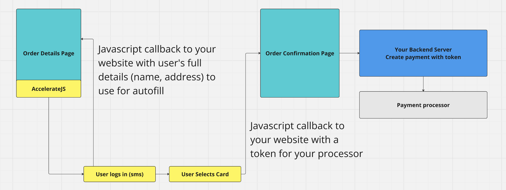
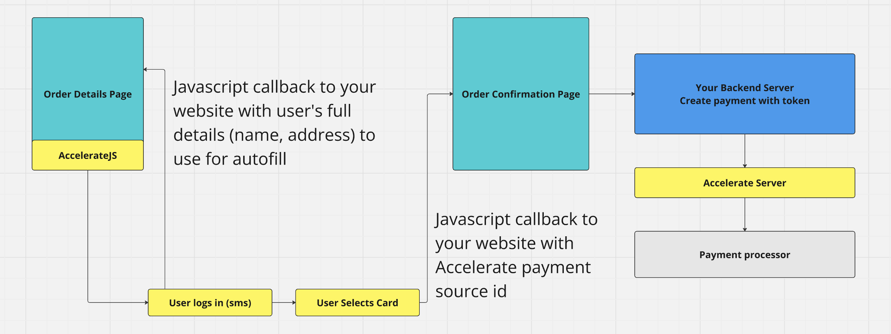

# Introduction

Accelerate integrates backend and frontend to provide a continuous checkout experience for your users. The frontend uses an iframe and a script tag to present a modal login flow and then the user's wallet of cards. The backend uses a simple token passing scheme to execute payments or can be used as a proxy to your payment processor.

The following steps are provided as a way to organize integrating with Accelerate and it is highly recommended that you read these docs and then meet with our engineering team to answer any questions you may have. Accelerate will provide engineering support to assist in the integration if needed.

1. Choose a backend integration flow:

[Backend integration](./Backend.md)

## Handoff flow

## Gateway flow

2. Choose a frontend style, either inline or modal: [Modes](./Modes.md) and [Frontend](./Frontend.md)

3. Test transactions in our sandbox environment: [Testing](./Testing.md)
