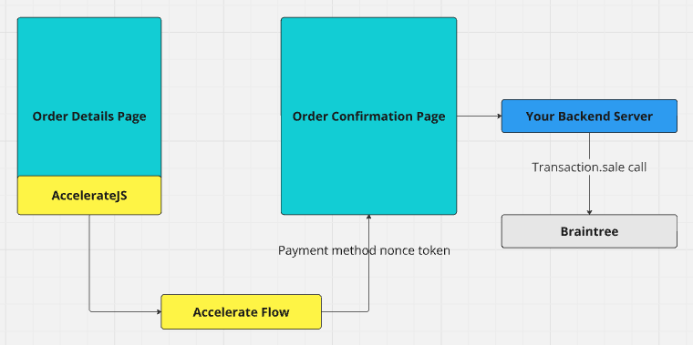

# Braintree

## Handoff Flow

The handoff flow is the most common integration flow with Accelerate and will likely be the most convenient. When initializing the frontend library for Accelerate, use:

```
checkoutMode: "BraintreeNonce",
checkoutFlow: "Inline"
```

Our service utilizes Braintree's payment method nonce values to pass as tokens to be authorized. To generate these we will use a client token generated by your existing integration. Your frontend will listen for `onCardSelected` callbacks from Accelerate and when the user's card details are needed will call `requestSource`:

```
onCardSelected: (cardId) => {
  //Store cardId somewhere!
}
// then:
const source = await window.accelerate.requestSource(cardId, {
  braintree: {
    clientToken: YOUR_CLIENT_TOKEN,
  },
});
// use source.processorToken (a Braintree nonce) to process the transaction!
```

See the [Transaction.sale docs](https://developer.paypal.com/braintree/docs/reference/request/transaction/sale) for more information on using them.



[Braintree basic example frontend code](../../demos/app/test/braintree/inline/page.tsx)\
[Braintree basic example backend code](../../demos/app/api/braintree/confirm/route.ts)

During the backend call to confirm you should perform all of the normal cart and stock verification that you would do — none of this will have happened yet. The call to transact using the nonce is also when the user’s instrument will be charged so failure cases will need to be handled appropriately by your services.

Upon successful charging of the user’s card a webhook should be emitted to Accelerate to provide us direct first hand feedback that the transaction was successful.

Note that the `InlinePayment` flow is not currently available for Braintree integrations. Contact your account manager if you feel this is required for your integration.

## Gateway Flow

Gateway flow for Braintree is not yet available. If this is required for an integration please contact our sales team.

## Reporting transaction status

Braintree does not support webhooks to report transaction status directly and as such the merchant service that executes the transaction will need to report the result directly back to Accelerate.

This involves sending a POST with details back to the Accelerate server.

```
POST https://sbx.api.weaccelerate.com/reporting/braintree
POST https://prd.api.weaccelerate.com/reporting/braintree
```

An authorization header must be included with an Accelerate-issued key:

```
headers: {
      Authorization: "accelerate-issued-key",
},
```

An open api specification file is available for this endpoint [here](https://sbx.api.weaccelerate.com/swagger/reporting/swagger.json)

A minimal example of executing this is shown in [the examples repo](https://github.com/weaccelerateinc/examples/blob/main/demos/app/api/braintree/confirm/route.ts)

Details of the payload body:

```
{
// This is the nonce value used to execute the transaction and is used by Accelerate to associate the result with the original request
  "accelerateToken": "string",

// The fields in the transaction block should be copied from the result of the transaction.sale call
  "transaction": {
    "id": "string",
    "amount": "string",
    "status": "string",
    "processorResponseText": "string"
  }
}
```
