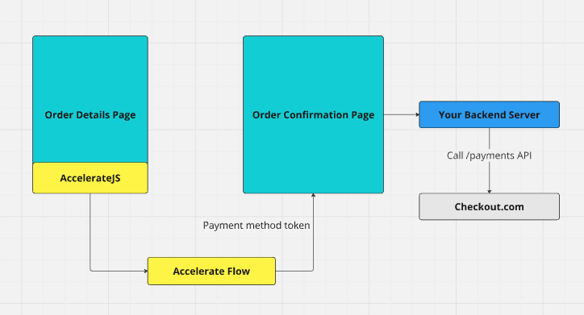

# Checkout.com

## Handoff Flow

The handoff flow is the most common integration flow with Accelerate and will likely be the most convenient. When initializing the frontend library for Accelerate, use:

```
checkoutMode: "CheckoutDotComToken"
```

Our service utilizes Checkout.coms's payment method tokens as vehicles for sensitive information. We create these using your api keys so they may be used directly. See the [Payment request documentation](https://api-reference.checkout.com/#operation/requestAPaymentOrPayout) for more information on using them.



[Checkout.com basic example frontend code](../../demos/app/test/checkoutdotcom/inline-payment/page.tsx)\
[Checkout.com basic example backend code](../../demos/app/api/checkoutdotcom/confirm/route.ts)

During the backend call to confirm you should perform all of the normal cart and stock verification that you would do — none of this will have happened yet. The call to transact using the token is also when the user’s instrument will be charged so failure cases will need to be handled appropriately by your services.

### Confirmation Call

In the handoff flow, it's important to include the processor token in the metadata for your backend's confirmation call. This ensures that the webhook events sent to Accelerate can be accurately matched. Ensure that you add the token as follows:&#x20;

```
metadata: {
        AccelerateToken: data.processorToken,
      },
```

## Gateway Flow

Gateway flow for Checkout.com is not yet available. If this is required for an integration please contact our sales team.

## Reporting transaction status

Checkout.com supports webhook configurations strong enough to implement all fo the reporting Accelerate requires.

The two endpoints for this webhook are:

```
https://sbx.api.weaccelerate.com/webhooks/checkoutdotcom (sandbox)
https://prd.api.weaccelerate.com/webhooks/checkoutdotcom (production)
```

Accelerate only requires 2 event types to be selected, Gateway - Payment approved and Gateway - Payment declined. Both the authorization header key and signature key should be added to your Accelerate account to ensure the safety of the webhook data. Your account manager will assist in ensuring this data is all correct before going live.
