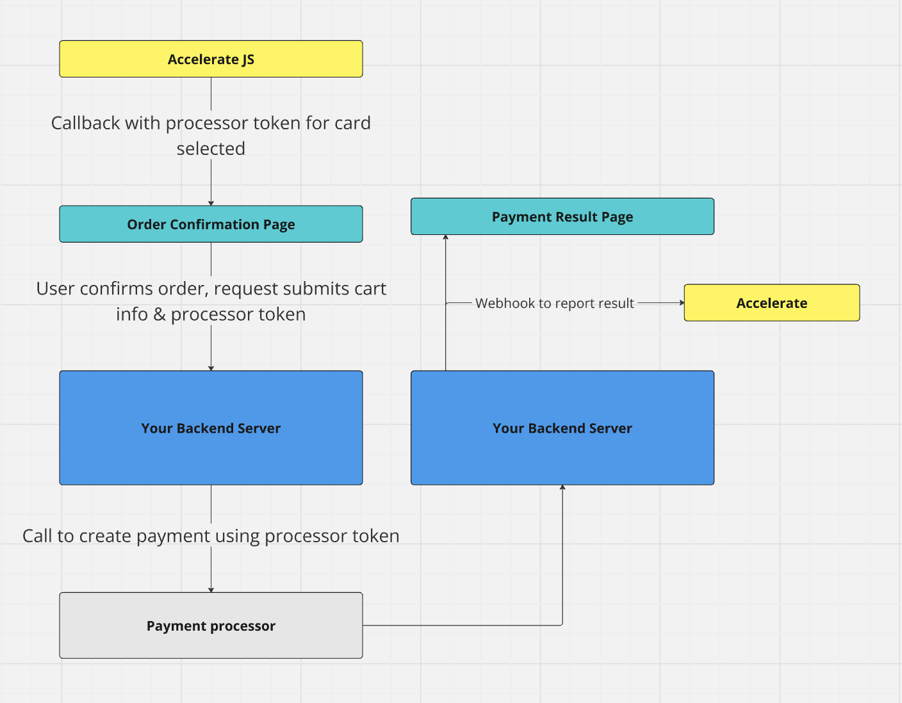
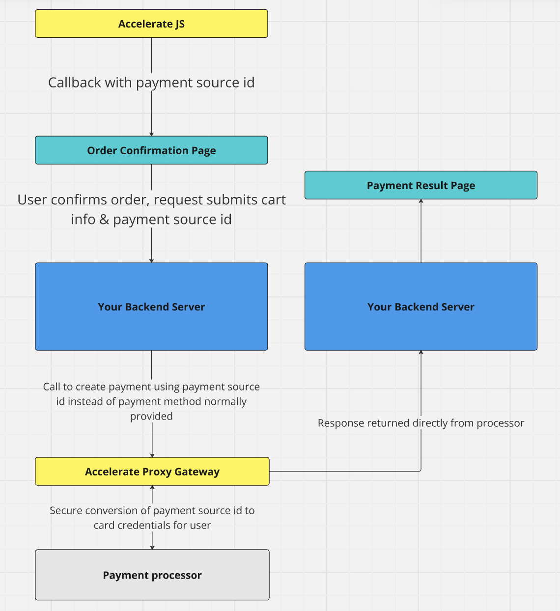

# Backend

## Handoff Flow

The backend integration for Accelerate will depend on the integration method you’ve chosen. For the handoff flow your frontend will have received some type of token for your processor. This token should be passed to your backend to create the payment. Once created successfully a webhook should be sent to Accelerate to confirm with us that it was used and successful.

## Gateway Flow

For the gateway flow your frontend will only receive a payment card id from our iframe. This should be included in the proxy call to your processor to create the payment. You will receive the response from the processor directly. There is no need to send us a webhook for the gateway flow.

## Choosing a mode

Most users integrate with Accelerate using a form of handoff flow. The gateway mode is intended for users that were already PCI SAQ-D compliant and have been handling raw card data. The gateway mode may also be required if your payment processor does not expose a convenient tokenized reference we can use as a handoff.

## Sending the reporting webhook

_This section of the documentation is incomplete and pending final drafts_

For integrations where Accelerate cannot observe the result of the authorization to the user's card we ask that you emit a webhook to our services when a transaction is attempted.
