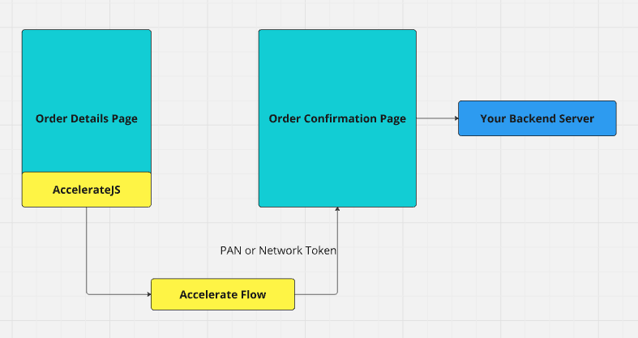

# Accelerate Platform Master Guide

This document combines the content from various markdown files within the `/docs` directory and its subdirectories to provide a comprehensive integration guide.

## <!-- Content from: docs/README.md -->

```
---
icon: star
---

# Introduction

Accelerate integrates backend and frontend to provide a continuous checkout experience for your users. The frontend uses an iframe and a script tag to present a modal login flow and then the user's wallet of cards. The backend uses a simple token passing scheme to execute payments or can be used as a proxy to your payment processor.

The following steps are provided as a way to organize integrating with Accelerate and it is highly recommended that you read these docs and then meet with our engineering team to answer any questions you may have. Accelerate will provide engineering support to assist in the integration if needed.

1. Choose a backend integration flow:

[Backend integration](setup/backend.md)

## Handoff flow


## Gateway flow


2. Choose a frontend style, either inline or modal: [Modes](setup/modes.md) and [Frontend](setup/frontend/)
3. Test transactions in our sandbox environment: [Testing](setup/testing.md)

## Processor specific documentation

[Stripe](integrations/stripe.md)

[Braintree](integrations/braintree.md)

[Checkout.com](integrations/checkoutdotcom.md)

[Direct handoff](integrations/handoffdirect.md)

```

---

## <!-- Content from: docs/Authentication.md -->

````
# Authentication Guide

This guide provides an overview of the authentication process when integrating with Accelerate, including the use of the `accelerate.login` and `accelerate.checkPhone` functions, session duration, and handling session timeouts.

## Authentication Flow

To authenticate a user, follow these steps:

### Collect User Information
Obtain the user's first name, last name, email, and phone number through your application's input fields.

### Call `accelerate.login`
After collecting the user's information, invoke the `accelerate.login` function. This function attempts to log in the user if an account exists or create a new account if it doesn't. In the provided demos, this check occurs during the `onBlur` event for these fields.

```jsx
// Example from the demo
const handleBlur = async () => {
  await accelerate.login({ firstName, lastName, email, phone });
};
````

For a detailed implementation, refer to the integrated demo [page](https://github.com/weaccelerateinc/examples/blob/main/demos/app/integrated/page.tsx#L146).

It is recommended have basic validation logic before calling the API. See [Example](https://github.com/weaccelerateinc/examples/blob/main/demos/app/integrated/page.tsx#L76).

### Two-Factor Authentication (2FA) Prompt

Upon calling `accelerate.login`, Accelerate will determine if the user requires 2FA. The conditions for displaying the 2FA pop-up are as follows:

- If the user's account exists, Accelerate will prompt for 2FA.
- If the account doesn't exist, Accelerate will create a new account and then prompt for 2FA.

### Optional `accelerate.checkPhone` Function

You can use the `accelerate.checkPhone` function to verify if a phone number corresponds to an existing Accelerate user. This function is optional and can be called frequently (e.g., every time the phone field changes) since it doesn't attempt to create a new user.

```jsx
// Example usage
const handlePhoneChange = async (phone) => {
  const exists = await accelerate.checkPhone(phone);
  // Handle the result accordingly
};
```

Implementing `accelerate.checkPhone` is optional; generally, invoking `accelerate.login` is sufficient.

## Session Duration

After a successful 2FA, the Accelerate login session lasts for 30 minutes. For an example of handling session duration, see the [example](https://github.com/weaccelerateinc/examples/blob/main/demos/app/test/checkoutdotcom/inline/page.tsx#L145).

## Handling Session Timeout and Re-authentication

The user's authentication is managed by the browser, storing credentials for Accelerate's domain using the iframe (cookies/local storage, etc.). The calls made communicate with the iframe and call Accelerate's API on the user's behalf, so your application doesn't directly handle sessions or authentication. If the session needs to be refreshed, calling accelerate.login triggers the 2FA flow, renewing the user's credentials.

To handle session timeouts and re-authentication:

1. **Detect Session Expiry**: If a request returns a `401` status, it indicates that the user's session has expired. The `accelerate.requestSource` function will return an object with the `status` property set to `401`.
2. **Re-initiate Login**: Call `accelerate.login` with the user's first name, last name, email, and phone number to trigger the 2FA flow again.

```jsx
// Example of re-authentication
const handleSessionExpiry = async () => {
  await accelerate.login({ firstName, lastName, email, phone });
  // Proceed with the original request after re-authentication
};
```

3. **Resume Operations**: After successful re-authentication, retry the original request or operation that failed due to session expiry. The `userLoggedIn` callback will be triggered by the library, allowing you to reattempt the `accelerate.requestSource` call.

This approach ensures a seamless user experience, allowing users to continue their tasks without significant interruptions.

```
---
<!-- Content from: docs/SUMMARY.md -->
---
```

# Table of contents

## Getting Started

- [Introduction](README.md)

## Setup

- [Frontend](setup/frontend/README.md)
  - [Authentication and Session](setup/frontend/authentication-and-session.md)
  - [Frontend Customization](setup/frontend/frontend-customization.md)
- [Backend](setup/backend.md)
- [Integration Modes](setup/modes.md)
- [Testing](setup/testing.md)

## Integrations

- [Stripe](integrations/stripe.md)
- [Braintree](integrations/braintree.md)
- [Checkout.com](integrations/checkoutdotcom.md)
- [Handoff flow for direct processing](integrations/handoffdirect.md)

---

- [Example Repos](examples.md)

```
---
<!-- Content from: docs/examples.md -->
---
```

---

## icon: cabinet-filing

# Example Repos

Accelerate provides standard integration plan examples in our public repository. These are intended to be used as reference implementations.

[Examples Repo](https://github.com/weaccelerateinc/examples)

```
---
<!-- Content from: docs/integrations/braintree.md -->
---
```

---

## icon: brain

# Braintree

## Handoff Flow

The handoff flow is the most common integration flow with Accelerate and will likely be the most convenient. When initializing the frontend library for Accelerate, use:

```
checkoutMode: "BraintreeNonce"
```

Our service utilizes Braintree's payment method nonce values to pass as tokens to be authorized. We create these using your api keys so they may be used directly. See the [Transaction.sale docs](https://developer.paypal.com/braintree/docs/reference/request/transaction/sale) for more information on using them.


[Braintree basic example frontend code](../../demos/app/test/braintree/inline-payment/page.tsx)
[Braintree basic example backend code](../../demos/app/api/braintree/confirm/route.ts)

During the backend call to confirm you should perform all of the normal cart and stock verification that you would do — none of this will have happened yet. The call to transact using the nonce is also when the user's instrument will be charged so failure cases will need to be handled appropriately by your services.

Upon successful charging of the user's card a webhook should be emitted to Accelerate to provide us direct first hand feedback that the transaction was successful.

## Gateway Flow

Gateway flow for Braintree is not yet available. If this is required for an integration please contact our sales team.

## Reporting transaction status

Braintree does not support webhooks to report transaction status directly and as such the merchant service that executes the transaction will need to report the result directly back to Accelerate.

This involves sending a POST with details back to the Accelerate server.

```
POST https://sbx.api.weaccelerate.com/reporting/braintree
POST https://prd.api.weaccelerate.com/reporting/braintree
```

An authorization header must be included with an Accelerate-issued key:

```
headers: {
      Authorization: "accelerate-issued-key",
},
```

An open api specification file is available for this endpoint [here](https://sbx.api.weaccelerate.com/swagger/reporting/swagger.json)

A minimal example of executing this is shown in [the examples repo](https://github.com/weaccelerateinc/examples/blob/main/demos/app/api/braintree/confirm/route.ts)

Details of the payload body:

```
{
// This is the nonce value used to execute the transaction and is used by Accelerate to associate the result with the original request
  "accelerateToken": "string",

// The fields in the transaction block should be copied from the result of the transaction.sale call
  "transaction": {
    "id": "string",
    "amount": "string",
    "status": "string",
    "processorResponseText": "string"
  }
}
```

```
---
<!-- Content from: docs/integrations/checkoutdotcom.md -->
---
```

---

## icon: cart-xmark

# Checkout.com

## Handoff Flow

The handoff flow is the most common integration flow with Accelerate and will likely be the most convenient. When initializing the frontend library for Accelerate, use:

```
checkoutMode: "CheckoutDotComToken"
```

Our service utilizes Checkout.coms's payment method tokens as vehicles for sensitive information. We create these using your api keys so they may be used directly. See the [Payment request documentation](https://api-reference.checkout.com/#operation/requestAPaymentOrPayout) for more information on using them.


[Checkout.com basic example frontend code](../../demos/app/test/checkoutdotcom/inline-payment/page.tsx)
[Checkout.com basic example backend code](../../demos/app/api/checkoutdotcom/confirm/route.ts)

During the backend call to confirm you should perform all of the normal cart and stock verification that you would do — none of this will have happened yet. The call to transact using the token is also when the user's instrument will be charged so failure cases will need to be handled appropriately by your services.

### Confirmation Call

In the handoff flow, it's important to include the processor toekn in the metadata for your backend's confirmation call. This ensures that the webhook events sent to Accelerate can be accurately matched. Ensure that you add the token as follows:

```
metadata: {
        AccelerateToken: data.processorToken,
      },
```

## Gateway Flow

Gateway flow for Checkout.com is not yet available. If this is required for an integration please contact our sales team.

## Reporting transaction status

Checkout.com supports webhook configurations strong enough to implement all fo the reporting Accelerate requires.

The two endpoints for this webhook are:

```
https://sbx.api.weaccelerate.com/webhooks/checkoutdotcom (sandbox)
https://prd.api.weaccelerate.com/webhooks/checkoutdotcom (production)
```

Accelerate only requires 2 event types to be selected, Gateway - Payment approved and Gateway - Payment declined. Both the authorization header key and signature key should be added to your Accelerate account to ensure the safety of the webhook data. Your account manager will assist in ensuring this data is all correct before going live.

```
---
<!-- Content from: docs/integrations/handoffdirect.md -->
---
```

---

## icon: handshake-simple

# Handoff flow for direct processing

If you are already PCI compliant and are able to accept raw credentials, Accelerate can offer you direct credentials as part of the handoff. This will mean that after a user selects their payment device you will be passed the full account number or a network token if we have one on file. When initializing the frontend library for Accelerate, use:

```
checkoutMode: "Direct",
checkoutFlow: "Inline"
```

Currently only the inline checkout flow is supported for the direct handoff.



Accelerate will vault all user card credentials for further use and create network tokens with the appropriate network processors when available.

The downstream use of the credentials are completely up to your service to handle -- authorization, capture, and reporting. Upon successful charging of the user's card a webhook must be emitted to Accelerate to provide us direct first hand feedback that the transaction was successful.

In practice, this will mean listening for the cardId the user selects from the Accelerate library:

```
onCardSelected: (id) => {
    setCardId(id);
},
```

Then using the card id to request credentials when the user is checking out:

```
const credentials = await window.accelerate.requestSource(cardId, cartTotal);

const cardAuthorization = await fetch("{{ YOUR BACKEND HERE }}", {
    method: "POST",
    body: JSON.stringify({
    card: {
        number: credentials.number,
        cvv: credentials.cvv,
    },
    // Alternatively, use network tokenization:
    // networkToken: {
    //   token: credentials.number,
    //   eci: credentials.eci,
    //   cryptogram: credentials.cryptogram,
    // },
    cartId: "some-cart",
    }),
});
```

```
---
<!-- Content from: docs/integrations/stripe.md -->
---
```

---

## icon: stripe

# Stripe

## Handoff Flow

The handoff flow is the most common integration flow with Accelerate and will likely be the most convenient. If you are using Stripe Elements or some stripe-js that is creating a payment intent then Accelerate should plug into your system very easily. When initializing the frontend library for Accelerate, use:

```
checkoutMode: "StripeToken"
```

For the Stripe handoff flow we are integrated into the payment intent api service. Our frontend will create an unconfirmed payment intent and pass the id of this object out to your frontend. Your frontend will then submit that payment intent id to your server to confirm. This is very similar to how Stripe Elements operates.

During the backend call to confirm you should perform all of the normal cart and stock verification that you would do — none of this will have happened yet. The confirmation of the intent is also when the user's instrument will be charged so failure cases will need to be handled appropriately by your services.

Upon successful charging of the user's card a webhook should be emitted to Accelerate to provide us direct first hand feedback that the transaction was successful.

## Gateway Flow

For the Stripe gateway flow we are also integrated on the payment intent api service. Your service will call the Stripe API proxied through our server:

```jsx
https://api.stripe.com/v1/payment_intents
becomes
https://prd.api.weaccelerate.com/v1/payment_intents
```

The payload will be exactly as you would have sent to Stripe except you will add the field:

```jsx
payment_method_data[card][number] = <payment card id your received from AccelerateJS>
```

The Stripe API libraries largely support proxy calls — their JavaScript client for example can execute proxied calls as such:

```jsx
const stripeClient = new Stripe("sk_YourStripeKey", {
  protocol: "https",
  host: "prd.api.weaccelerate.com",
});
```

```
---
<!-- Content from: docs/setup/backend.md -->
---
```

---

## icon: send-backward

# Backend

## Handoff Flow

The backend integration for Accelerate will depend on the integration method you've chosen. For the handoff flow your frontend will have received some type of token for your processor. This token should be passed to your backend to create the payment. Once created successfully a webhook should be sent to Accelerate to confirm with us that it was used and successful.


## Gateway Flow

For the gateway flow your frontend will only receive a payment card id from our iframe. This should be included in the proxy call to your processor to create the payment. You will receive the response from the processor directly. There is no need to send us a webhook for the gateway flow.


## Choosing a mode

Most users integrate with Accelerate using a form of handoff flow. The gateway mode is intended for users that were already PCI SAQ-D compliant and have been handling raw card data. The gateway mode may also be required if your payment processor does not expose a convenient tokenized reference we can use as a handoff.

## Reporting transaction results

Most processors support sending webhooks to arbitrary endpoints that allow the reporting of transaction statuses. For these processors a webhook should be configured to be sent to the Accelerate backend. Processor's documentation will include instructions on how to configure this webhook.

For integrations where Accelerate can't receive a webhook directly from the processor it will be necessary to call Accelerate and directly report the results of a transaction. This entails sending a POST request to the /reporting/{processor} endpoint and the details of this call are included in processor-specific documentation.

```
---
<!-- Content from: docs/setup/modes.md -->
---
```

---

## icon: square-code

# Integration Modes

## Choosing a payment model

Accelerate offers two modes to execute payments: the handoff mode and the gateway mode. For the handoff mode, our frontend will pass a token or instrument credentials to your frontend. In gateway mode, your backend will call our backend as a proxy to your payment processor.

Handoff mode is the preferred and most common mode of integration with Accelerate. If you are unsure which mode is the best fit please reach out to your account manager to help decide.

### Handoff Mode

The Accelerate script will call `onPaymentInitiated` with the credentials you need to begin a payment flow. Your frontend will then use the result of that to create a payment -- typically this will be by passing the token or credentials to your backend to execute against your payment processor.

If you are already using Stripe Elements or an "iframe" integration from some other provider, this may be a very good fit for you since the token that these emit to your server will likely be the same token that we will emit. This means your backend integration will be almost identical to your standard flow.

### Gateway Mode

In the gateway mode Accelerate acts as a proxy between you and the processor for transactions that involve an Accelerate provided payment instrument. The call you make to us will be identical to the call you would have made to the processor except with our payment instrument id inserted where appropriate (the integration guides will go over this specifically for each processor).

Accelerate will use that identifier to inject the real card information during the execution of the call to the processor. This means your transaction may be executed using a network token or a full account number as appropriate.

The response you get will be the untampered response from the processor. You will then be responsible for handling the success/failure of the transaction. This mode is intended largely for merchants who were already handling raw card details on their server to execute transactions or who are using processors that don't provide convenient tokenization systems to limit card information to their iframes.

However, if done using Accelerate you will _not_ be subjected to any information within PCI scope -- you will only reference the cards by their Accelerate identifiers and never be exposed to the raw details.

## Choosing a frontend style

Choosing a frontend style for the Accelerate integration is a bit simpler: you simply will choose the mode you think fits better in your site's user experience. This is controlled by the `checkoutFlow` parameter to the `init` call of the Accelerate script.

### Inline

See [Example](../../demos/app/integrated/page.tsx)

The inline flow will involve starting the AccelerateJS system to log the user in and then showing their wallet of cards within the elements of your existing checkout page. On the technical side, this is done by adding a div:

```
<div id="accelerate-wallet"/>
```

Once the user has logged in their wallet will be shown in an iframe on this div. For React users, please see AccelerateWallet.tsx in our React samples at: [Examples Repo](https://github.com/weaccelerateinc/examples).

This mode makes the user experience as seamless as possible while still providing all of the benefits of Accelerate. The callback `onPaymentInitiated` will be called with the credentials you need to begin checkout -- typically this is a payment processor token.

Your UI is responsible for the final "Pay Now" button presentation and handling.

### InlinePayment

See [Example](https://github.com/weaccelerateinc/examples/blob/main/demos/app/test/braintree/inline-payment/page.tsx)

This mode is similar to `Inline` mode except our UI will present a "Pay Now" button and allow the user to click it. The checkout page must then handle `onPaymentInitiated` as if it was the final step of the checkout and begin processing the payment.

### Modal

See [Example](../../demos/app/modal/page.tsx)

The modal integration is for sites that don't wish to add any elements to their existing content to support the Accelerate wallet flow. The entire user experience will exist as an iframe that appears above your content until the user has selected a card. If they need to choose a new one, the modal will need to re-appear.

In handoff mode the call to `onPaymentInitiated` will be made when the modal is closed (user is done selecting a card) and this will include presentational details as well if you wish to show them a preview of the card they have selected. Alternatively, you may use the Accelerate wallet to show their selected card.

```
---
<!-- Content from: docs/setup/testing.md -->
---
```

---

## icon: vial-virus

# Testing

To test the Accelerate integration you will use our sandbox environment. We will provide you with a test phone number to use as part of the modal login flow and the account this resolves to will have cards to test transactions with. Your merchant id will be the same for sandbox and production.

## Changed endpoints

There are a few changes to access our sandbox environment that are needed:

Include the script from our sandbox hosting:

```
<script TODO_HOSTING_URL>
```

Change any API or proxy calls you are making to Accelerate to

```
sbx.api.weaccelerate.com
```

## Test phone numbers

Test phone numbers are coming soon.

## Test card numbers

Test card numbers vary by processor, generally you will use the same card numbers that you would use for directly testing your payment processor.

```
---
<!-- Content from: docs/setup/frontend/README.md -->
---
```

---

## icon: coin-front

# Frontend

Accelerate will act as JavaScript added to your checkout pages and if you are using an inline flow, we will also display the list of payment cards in an iframe at a location of your choosing.

Our JavaScript will give you several callback points to get data from Accelerate and attach a few useful functions to the window object if you need imperative access.

A script tag can be used to include our JavaScript:

In NextJS:

```jsx
<Script type="module" src={"https://sbx.js.weaccelerate.com/accelerate.js"} strategy="afterInteractive" />
```

In plain HTML:

```jsx
<script src="https://sbx.js.weaccelerate.com/accelerate.js" crossorigin="anonymous" type="module" />
```

In production, use `https://js.weaccelerate.com/accelerate.js` for the script.

## Initializing Accelerate

To initialize the Accelerate flow, a call must be made to the object our script attaches to the global window:

```
window.accelerate.init({
            merchantId: <<your merchant id>>,
            amount: <<amount in the cart in pennies USD>>,
            ...options
});
```

This function may be called again - only the last set of options it was called with will be used.

## Starting the login

After init is called we can then listen for various user inputs and decide when to start the Accelerate login flow. This is completely up to the checkout page to decide. In general, your page should wait for the user to finish entering details into the phone number, email, first name, and last name fields and then call login:

```
window.accelerate.login({
      firstName,
      lastName,
      email
      phoneNumber,
});
```

Example of calling accelerate.login on input blur event to ensure that the 2FA pop-up is displayed based on the user's input status.

```
                  <input
                    data-testid="first-name-input"
                    value={firstName}
                    onChange={(e) => setFirstName(e.target.value)}
                    onBlur={() => {
                      maybeLogin(phoneNumber);
                    }}
                    placeholder="First name"
                    className="flex-1 px-3 py-3 border border-neutral-200 rounded-md focus:ring-2 focus:ring-sky-500 outline-none"
                  />
                  <input
                    data-testid="last-name-input"
                    value={lastName}
                    onChange={(e) => setLastName(e.target.value)}
                    onBlur={() => {
                      maybeLogin(phoneNumber);
                    }}
                    placeholder="Last name"
                    className="flex-1 px-3 py-3 border border-neutral-200 rounded-md focus:ring-2 focus:ring-sky-500 outline-none"
                  />
                </div>
                <input
                  value={email}
                  onChange={(e) => setEmail(e.target.value)}
                  placeholder="Email"
                  className="w-full px-3 py-3 border border-neutral-200 rounded-md focus:ring-2 focus:ring-sky-500 outline-none"
                />
                <input
                  value={phoneNumber}
                  onChange={(e) => {
                    setPhone(tryFormatPhone(e.target.value));
                    maybeLogin(e?.target.value);
                  }}
                  placeholder="Phone number"
                  type="tel"
                  className="w-full px-3 py-3 border border-neutral-200 rounded-md focus:ring-2 focus:ring-sky-500 outline-none"
                />
```

This will cause the Accelerate login modal to appear and the user will go through the Accelerate flow. The Accelerate engineering team can help implement this correctly if it is not clear where this should occur.

## Handling the callbacks

Once the Accelerate flow has started all state updates will be passed out in the form of callbacks. These are registered during the call to `init` above. Not all of them will be needed depending on how Accelerate has been integrated.

### onLoginSuccess

This callback is called when the user has finished going through the Accelerate login flow and either has an existing account or has created a new one with us. We will emit as many details about the user's account as we have -- these may be useful for autofilling in parts of the page that are still empty. The Stripe example repo shows how this can be used to autofill the address fields.

### onPaymentInitiated

This callback is called when the user has made a final selection for the Accelerate card they have decided to use. This is useful during inline flows where the payment flow should begin as soon as the user is done selecting their card.

### onCardSelected

This callback is called whenever the user has selected a new payment instrument. This is only called for cards that have been confirmed through the Accelerate flow. This is useful during flows where `onPaymentInitiated` may not be called and the only piece of information your integration needs is the card id.

## Other options in the init call

`checkoutMode` and `checkoutFlow` should both be provided - see [Modes](../modes.md)

## Adding the Wallet iframe element

The Accelerate wallet will render as an iframe on your page if you have chosen an inline flow. To control where Accelerate renders simply add a div to your layout at the appropriate place:

```
<div id="accelerate-wallet"/>
```

The iframe will render as a child to this div.

## Typescript

For TypeScript users, we publish a type definition to npm as part of the `accelerate-js-types` package. Simply install this and use the included types as needed. It is recommended to attach the Accelerate API handle to the global window type via:

```jsx
import type { AccelerateWindowAPI } from "accelerate-js-types";

declare global {
  interface Window {
    accelerate: AccelerateWindowAPI;
  }
}
```

```
---
<!-- Content from: docs/setup/frontend/authentication-and-session.md -->
---
```

---

## icon: user

# Authentication and Session

### Authentication Guide

This guide provides an overview of the authentication process when integrating with Accelerate, including the use of the `accelerate.login` and `accelerate.checkPhone` functions, session duration, and handling session timeouts.

To authenticate a user, follow these steps:

#### Collect User Information

Obtain the user's first name, last name, email, and phone number through your application's input fields.

#### Call `accelerate.login`

After collecting the user's information, invoke the `accelerate.login` function. This function attempts to log in the user if an account exists or create a new account if it doesn't. In the provided demos, this check occurs during the `onBlur` event for these fields.

```
// Example from the demo
const handleBlur = async () => {
  await accelerate.login({ firstName, lastName, email, phone });
};
```

For a detailed implementation, refer to the integrated demo [page](../../../demos/app/integrated/page.tsx#L146).

It is recommended have basic validation logic before calling the API. See [Example](../../../demos/app/integrated/page.tsx#L76).

#### Two-Factor Authentication (2FA) Prompt

Upon calling `accelerate.login`, Accelerate will determine if the user requires 2FA. The conditions for displaying the 2FA pop-up are as follows:

- If the user's account exists, Accelerate will prompt for 2FA.
- If the account doesn't exist, Accelerate will create a new account and then prompt for 2FA.

#### Optional `accelerate.checkPhone` Function

You can use the `accelerate.checkPhone` function to verify if a phone number corresponds to an existing Accelerate user. This function is optional and can be called frequently (e.g., every time the phone field changes) since it doesn't attempt to create a new user.

```
// Example usage
const handlePhoneChange = async (phone) => {
  const exists = await accelerate.checkPhone(phone);
  // Handle the result accordingly
};
```

Implementing `accelerate.checkPhone` is optional; generally, invoking `accelerate.login` is sufficient.

### Session Duration

After a successful 2FA, the Accelerate login session lasts for 30 minutes. For an example of handling session duration, see the [example](../../../demos/app/test/checkoutdotcom/inline/page.tsx#L145).

### Handling Session Timeout and Re-authentication

The user's authentication is managed by the browser, storing credentials for Accelerate's domain using the iframe (cookies/local storage, etc.). The calls made communicate with the iframe and call Accelerate's API on the user's behalf, so your application doesn't directly handle sessions or authentication. If the session needs to be refreshed, calling accelerate.login triggers the 2FA flow, renewing the user's credentials.

To handle session timeouts and re-authentication:

1. **Detect Session Expiry**: If a request returns a `401` status, it indicates that the user's session has expired. The `accelerate.requestSource` function will return an object with the `status` property set to `401`.
2. **Re-initiate Login**: Call `accelerate.login` with the user's first name, last name, email, and phone number to trigger the 2FA flow again.

```
// Example of re-authentication
const handleSessionExpiry = async () => {
  accelerate.closeWallet(); // Close Wallet if it was open
  await accelerate.login({ firstName, lastName, email, phone });
  // Proceed with the original request after re-authentication
};
```

3. **Resume Operations**: After successful re-authentication, retry the original request or operation that failed due to session expiry. The `userLoggedIn` callback will be triggered by the library, allowing you to reattempt the `accelerate.requestSource` call. If the user had their wallet opened before, you may now call `accelerate.openWallet` again.

This approach ensures a seamless user experience, allowing users to continue their tasks without significant interruptions.

```
---
<!-- Content from: docs/setup/frontend/frontend-customization.md -->
---
```

---

## icon: fill-drip

# Frontend Customization

This guide explains how to customize the frontend elements of Accelerate, including the 2FA modal and the card wallet. Customization is applied whenever Accelerate is initialized by including the custom theme in the script configuration.

### Applying Custom Themes

To apply a custom theme when initializing Accelerate, include the `customTheme` property in the script configuration.

#### Example Initialization with Custom Theme

```
<Script
  crossOrigin="anonymous"
  type="module"
  src={process.env.NEXT_PUBLIC_ACCELERATE_VERIFY_JS_SCRIPT}
  strategy="afterInteractive"
  onReady={() => {
    window.accelerate.init({
      amount: stripeOptions.amount,
      merchantId: process.env.NEXT_PUBLIC_MERCHANT_ID!,
      checkoutFlow: "Inline",
      // eslint-disable-next-line @typescript-eslint/no-explicit-any
      checkoutMode: "CheckoutDotComToken" as any, // TODO: Fix typing
      onLoginSuccess: (user) => {
        console.log("Accelerate user logged in", { user });
        maybeUseAccelUser(user);
      },
      onCardSelected: (cardId) => {
        setCardId(cardId);
      },
      onLogout: () => {
        console.log("Accelerate user logged out");
      },
      customTheme: {
        fontFamily: "Lato",
        typography: {
          allVariants: {
            color: "rgba(0,0,0,0.85)",
            fontSize: "12px",
          },
          h2: {
            fontSize: "24px",
          },
          caption: {
            fontSize: "16px",
          },
        },
      },
    });
  }}
/>
```

### Customization Options

#### Font Family

Set a custom font family by specifying the `fontFamily` property under `customTheme`. At the moment, we only support the font families "Inter" and "Lato". If you would like to request to use additional font families please contact your account manager.

#### Typography

Modify typography settings such as font size and color for different text elements.

**Global Typography**

```
{
  "typography": {
    "allVariants": {
      "color": "rgba(0,0,0,0.85)",
      "fontSize": "12px"
    }
  }
}
```

**Heading Customization**

```
{
  "typography": {
    "h2": {
      "fontSize": "24px"
    }
  }
}
```

**Caption Styling**

```
{
  "typography": {
    "caption": {
      "fontSize": "16px"
    }
  }
}
```

### Summary

By applying the `customTheme` property during initialization, you can tailor the look and feel of Accelerate's frontend elements, such as the 2FA modal and card wallet, to match your brand's design requirements.

```
---

</rewritten_file>
```
